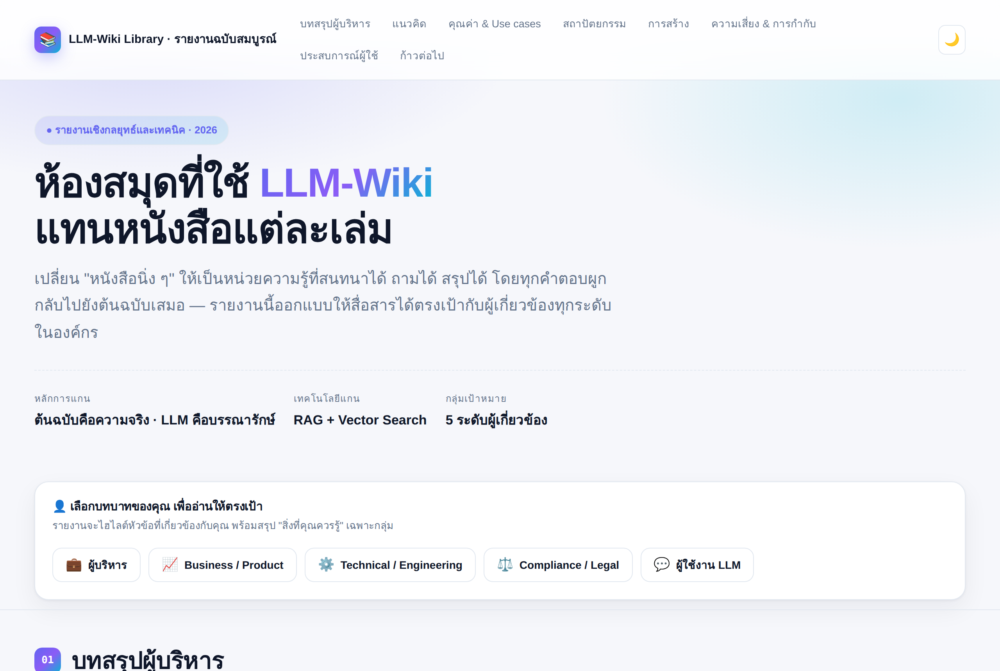
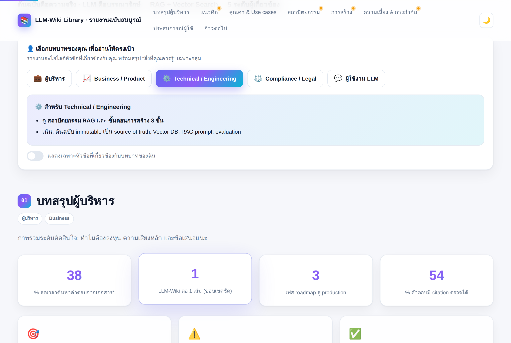
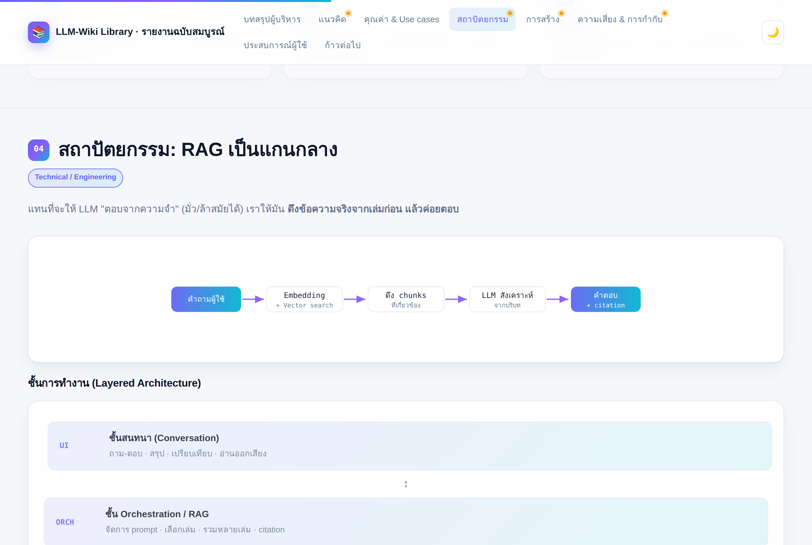
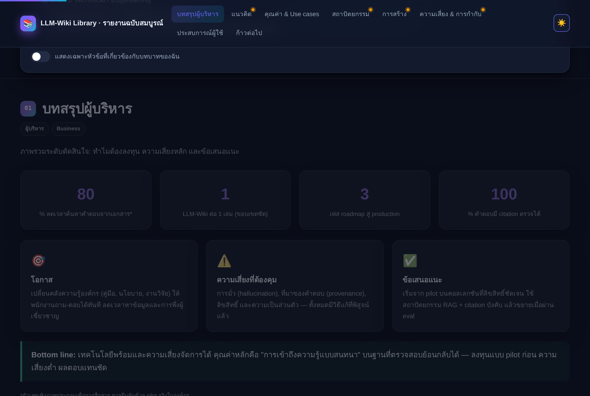
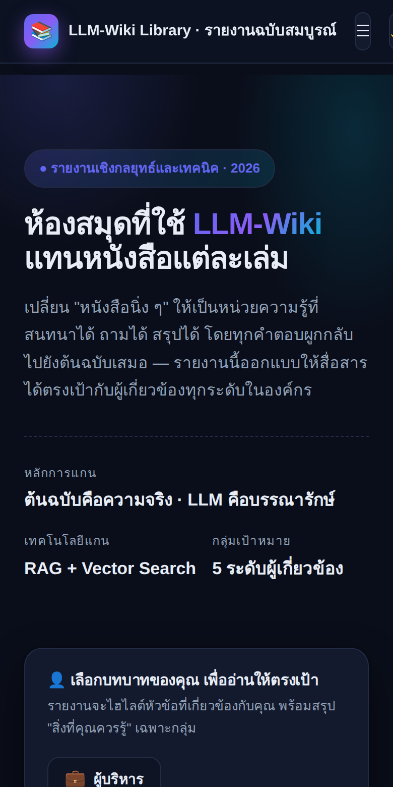

# ห้องสมุดทำงานอย่างไร (How a Library Works)

งานค้นคว้าว่าด้วยกลไกการทำงานของห้องสมุด ปัญหาที่ห้องสมุดต้องเผชิญ
และวิธีแก้ปัญหาที่ห้องสมุดนำมาใช้

## สารบัญ

- [งานค้นคว้าหลัก: ห้องสมุดทำงานอย่างไร](docs/how-library-works.md)
- [ปัญหาและวิธีแก้ปัญหา](docs/problems-and-solutions.md)
- [ห้องสมุดแตกต่างจาก Wiki อย่างไร](docs/library-vs-wiki.md)
- [วิธีการทำห้องสมุดดิจิทัล](docs/how-to-build-digital-library.md)
- [อภิธานศัพท์ (Glossary)](docs/glossary.md)

### ชุดงานวิจัย: LLM-Wiki Library (หัวข้อหลัก)

ห้องสมุดของ "หนังสือที่เป็น LLM-Wiki": ผลิตหนังสือแต่ละเล่มด้วยไปป์ไลน์
`ingest → synthesis → lint → query` (แรงบันดาลใจจาก Karpathy LLM Wiki)
แล้วนำหลักการห้องสมุดกายภาพมาเก็บหนังสือเหล่านั้นแบบ citation

- [00 · ภาพรวมและโมเดลแนวคิด (Canonical Overview)](docs/llm-wiki/00-overview.md)
- [01 · ไปป์ไลน์ผลิตหนังสือ (ingest→synthesis→lint→query)](docs/llm-wiki/01-book-pipeline.md)
- [02 · หนังสือหนึ่งเล่ม (llm-wiki-book)](docs/llm-wiki/02-llm-wiki-book.md)
- [03 · หลักการห้องสมุดกายภาพที่นำมาใช้](docs/llm-wiki/03-physical-library-principles.md)
- [04 · การรวมร่างเป็น llm-wiki-library (citation)](docs/llm-wiki/04-llm-wiki-library.md)
- [05 · Worked Example — สร้างหนึ่งเล่มแบบ end-to-end](docs/llm-wiki/05-worked-example.md)
- [06 · เอกสาร Schema ตัวอย่าง (CLAUDE.md)](docs/llm-wiki/06-schema-example.md)
- [07 · Roadmap การ implement (เฟส 0–5)](docs/llm-wiki/07-implementation-roadmap.md)
- [08 · ทีมผู้เชี่ยวชาญและธรรมาภิบาล](docs/llm-wiki/08-expert-team-and-governance.md)
- [09 · Reference Stack และ Ops](docs/llm-wiki/09-reference-stack-and-ops.md)

> เอกสารรุ่นก่อน (กรอบ RAG-centric ซึ่งปรับแล้ว) เก็บไว้เพื่ออ้างอิง:
> [ห้องสมุดที่ใช้ LLM-Wiki แทนหนังสือแต่ละเล่ม](docs/llm-wiki-library.md) ·
> [Workflow การศึกษาและนำ LLM-Wiki มาใช้](docs/llm-wiki-adoption-workflow.md)

## 📊 รายงานฉบับสมบูรณ์ (Interactive Report)

- [รายงาน LLM-Wiki Library (single-file HTML)](report/index.html) —
  รายงานเว็บแบบโต้ตอบได้ สำหรับสื่อสารผู้เกี่ยวข้อง 5 ระดับ
  (ผู้บริหาร, Business/Product, Technical, Compliance/Legal, ผู้ใช้งาน LLM)
  มี Role Selector, dark mode, diagram, และพิมพ์เป็น PDF ได้

  > เปิดใช้งาน: เปิดไฟล์ `report/index.html` ในเบราว์เซอร์ (เนื้อหา/สคริปต์ฝังในไฟล์
  > ใช้งานได้แม้ออฟไลน์ ส่วนฟอนต์โหลดจาก CDN เมื่อออนไลน์ ถ้าออฟไลน์จะใช้ฟอนต์ระบบ)
  > หรือ host เป็น GitHub Pages เพื่อแชร์ลิงก์ในองค์กร

### ตัวอย่างหน้าจอ (Screenshots)

| Hero + Role Selector (Light) | Role Selector ทำงาน (เลือก Technical) |
|:---:|:---:|
|  |  |

| สถาปัตยกรรม RAG + Diagram | บทสรุปผู้บริหาร (Dark mode) |
|:---:|:---:|
|  |  |

   
  <em>มุมมองบนมือถือ (Responsive · Dark mode)</em>

## ภาพรวมโดยย่อ

ห้องสมุดคือระบบที่ออกแบบมาเพื่อ **จัดเก็บ จัดระเบียบ ค้นหา และหมุนเวียน**
ทรัพยากรสารสนเทศ (หนังสือ วารสาร สื่อดิจิทัล ฯลฯ) ให้คนจำนวนมากใช้งานร่วมกัน
ได้อย่างมีประสิทธิภาพ หัวใจของห้องสมุดไม่ใช่แค่ "ที่เก็บหนังสือ"
แต่คือ **ระบบจัดการข้อมูล** ที่ทำให้เราหาของหนึ่งชิ้นจากของนับแสนชิ้นเจอได้ในเวลาไม่กี่นาที

> หมายเหตุ: งานชิ้นนี้เน้นห้องสมุดในความหมายจริง (สถานที่/องค์กร)
> และในตอนท้ายมีการเทียบเคียงกับแนวคิดทาง **วิทยาการคอมพิวเตอร์**
> เพราะหลายปัญหาของห้องสมุดคือต้นแบบของโครงสร้างข้อมูลและอัลกอริทึมที่เราใช้กันทุกวันนี้
